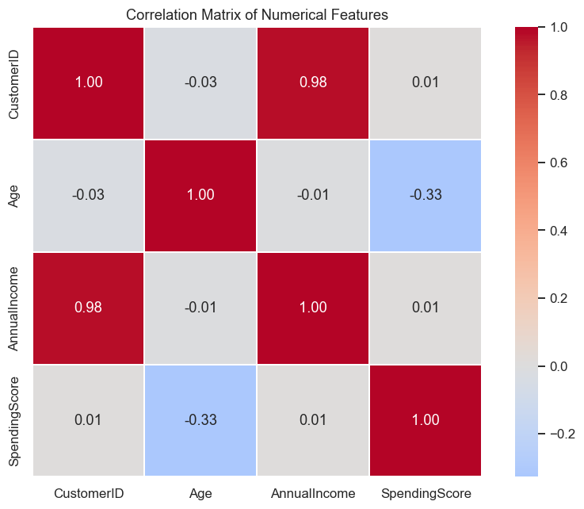
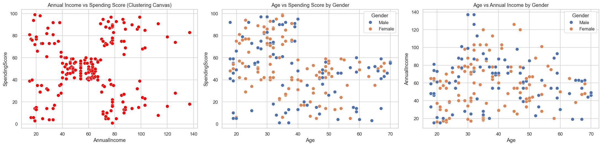
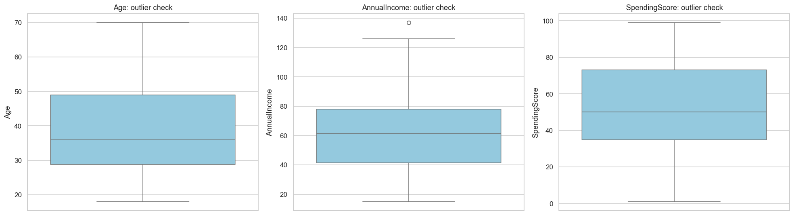
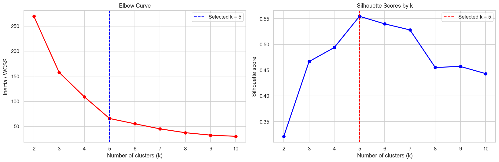
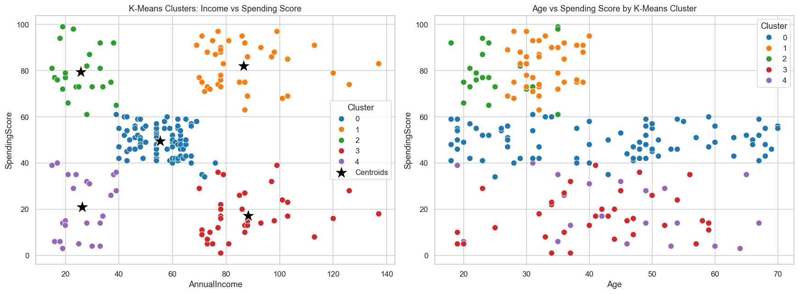
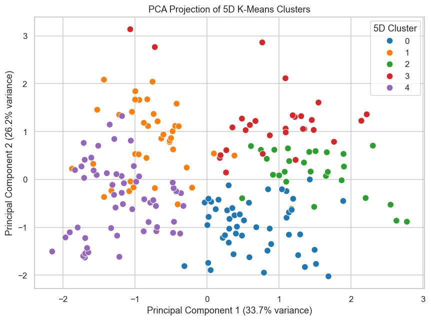
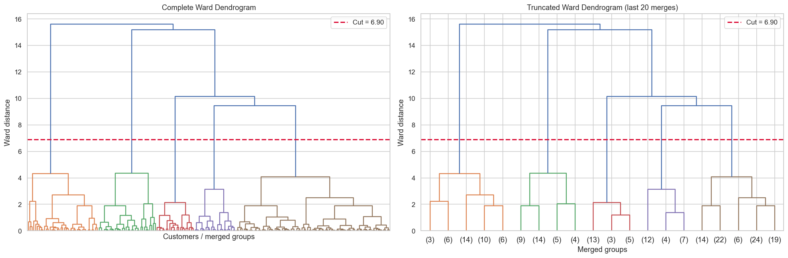
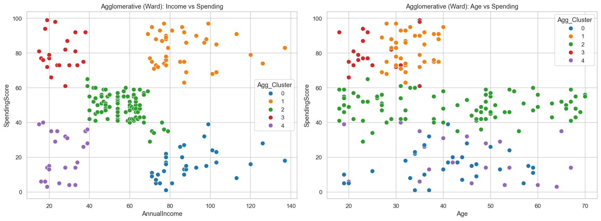
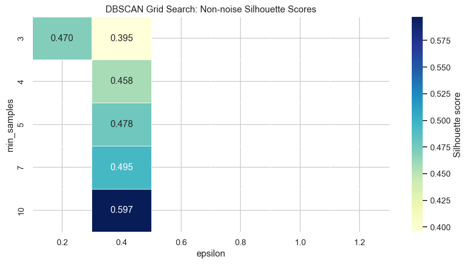
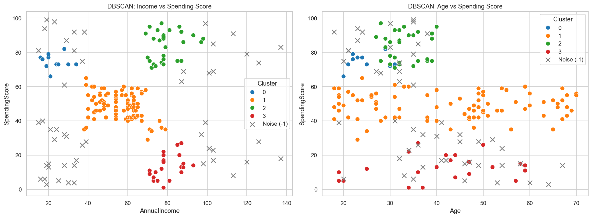

<div align="center">

# 🛍️ Mall Customer Segmentation using Unsupervised Machine Learning


<p align="center">


</p>

### 🚀 Discover • Segment • Understand • Grow

⭐ Customer Segmentation using **K-Means**, **Agglomerative Clustering**, **DBSCAN**, and **PCA**

</div>

---

# 📖 Table of Contents

- ✨ Project Overview
- 🎯 Objectives
- 📂 Dataset
- 🛠️ Technologies Used
- 📊 Exploratory Data Analysis
- 🤖 Machine Learning Models
- 📈 Results
- 💼 Business Insights
- 📸 Project Screenshots
- 📁 Project Structure
- 🚀 Installation
- 📦 Requirements
- 🔮 Future Improvements
- 👨‍💻 Author

---

# ✨ Project Overview

Customer segmentation is one of the most important applications of Machine Learning in Retail Analytics.

This project analyzes the **Mall Customer Dataset** using **Unsupervised Machine Learning Algorithms** to identify customer groups based on purchasing behavior.

The generated customer segments help businesses:

- 🎯 Target the right customers
- 💰 Increase sales
- 🛍️ Improve customer experience
- 📈 Design personalized marketing campaigns
- ❤️ Improve customer retention

---

# 🎯 Objectives

✔ Perform Exploratory Data Analysis (EDA)

✔ Detect Outliers

✔ Build Customer Segments

✔ Compare Multiple Clustering Algorithms

✔ Visualize Clusters

✔ Save Trained Model

✔ Generate Business Insights

---

# 📂 Dataset

| Feature | Description |
|----------|-------------|
| 🆔 CustomerID | Unique Customer ID |
| 🚻 Gender | Male / Female |
| 👤 Age | Customer Age |
| 💰 Annual Income | Annual Income (k$) |
| 🛒 Spending Score | Spending Score (1–100) |

### Dataset Summary

| Description | Value |
|------------|------|
| 👥 Total Customers | 200 |
| 📊 Features | 5 |
| ❌ Missing Values | 0 |
| 🔁 Duplicate Rows | 0 |

---

# 🛠️ Technologies Used

- 🐍 Python
- 📊 Pandas
- 🔢 NumPy
- 📉 Matplotlib
- 🎨 Seaborn
- 🤖 Scikit-Learn
- 📦 Joblib
- 📒 Jupyter Notebook

---

# 📊 Exploratory Data Analysis

## 📌 Correlation Matrix



### Insights

- Age has a weak negative relationship with Spending Score.
- Annual Income has almost no correlation with Spending Score.
- CustomerID is not useful for clustering.

---

## 📌 Scatter Plot Analysis



Observations

- Natural customer groups exist.
- Spending behavior differs greatly even for similar income.

---

## 📌 Outlier Detection



Only Annual Income contains a few outliers.

---

# 🤖 Machine Learning Models

## ⭐ K-Means Clustering

### Elbow Method



Selected

✔ k = 5

✔ Silhouette Score = **0.556**

---

### Cluster Visualization



---

### PCA Projection



---

# 🌲 Agglomerative Clustering

### Ward Dendrogram



---

### Agglomerative Clusters



---

# 🌐 DBSCAN

### Grid Search



---

### DBSCAN Clusters



Best Parameters

```
epsilon = 0.4
min_samples = 10
Silhouette = 0.597
```

---

# 📈 Model Comparison

| Algorithm | Parameters | Silhouette Score | Status |
|------------|-----------|----------------:|--------|
| 🥇 K-Means | k = 5 | **0.556** | ⭐ Recommended |
| 🥈 Agglomerative | Ward | ~0.55 | Excellent |
| 🥉 DBSCAN | eps = 0.4 | **0.597** | Best for Dense Clusters |

---

# 💼 Business Insights

## 💎 Premium Customers

- High Income
- High Spending

Recommendation

Luxury Products

VIP Membership

Exclusive Offers

---

## 🛍️ Careful Customers

- High Income
- Low Spending

Recommendation

Personalized Promotions

Premium Discounts

---

## 👨‍👩‍👧 Average Customers

- Medium Income

- Medium Spending

Recommendation

Loyalty Programs

Cross Selling

---

## 💰 Budget Customers

- Low Income

- Low Spending

Recommendation

Discount Coupons

Budget Products

---

## ⭐ Young Target Customers

- Low Income

- High Spending

Recommendation

Fashion

Electronics

Festival Offers

---
---

# 📁 Project Structure

```text
Mall-Customer-Segmentation
│
├── Images
│   ├── banner.png
│   ├── BVA_heatmap.png
│   ├── BVA_scatterplots.png
│   ├── Clusters.png
│   ├── Clusters2.png
│   ├── Boxplot.png
│   ├── Kmean_elbow.png
│   ├── DBSCAN_GS_heatmap.png
│   ├── DBSCAN_income_age_vs_spending_score.png
│   ├── Dendogram.png
│   └── agglomerative_income_age_vs_spending.png
│
├── Mall_Customers.csv
├── mall_customers_eda.ipynb
├── mall_segmentation_model.pkl
├── mall_scaler.pkl
├── requirements.txt
├── README.md
└── LICENSE
```

---

# 🚀 Installation

```bash
git clone https://github.com/yourusername/Mall-Customer-Segmentation.git

cd Mall-Customer-Segmentation

pip install -r requirements.txt

jupyter notebook mall_customers_eda.ipynb
```

---

# 📦 Requirements

```txt
pandas
numpy
matplotlib
seaborn
scikit-learn
scipy
joblib
nbformat
```

---

# 🔮 Future Improvements

- 🌐 Streamlit Dashboard
- 🤖 Real-Time Prediction API
- ☁ Cloud Deployment
- 📱 Mobile Application
- 📊 Deep Learning-based Customer Segmentation

---

# 👨‍💻 Author

## Badshaa

🎓 Engineering Student

📧 Feel free to connect for collaboration.

---
[Visit My Video](https://drive.google.com/file/d/1ZZq0TZRfnzKKbrPvTyEEdJ1XJ54197Uc/view?usp=sharing)
<div align="center">

## ⭐ If you like this project

Please give it a ⭐ on GitHub!

Made with ❤️ by **Badshaa**

</div>
